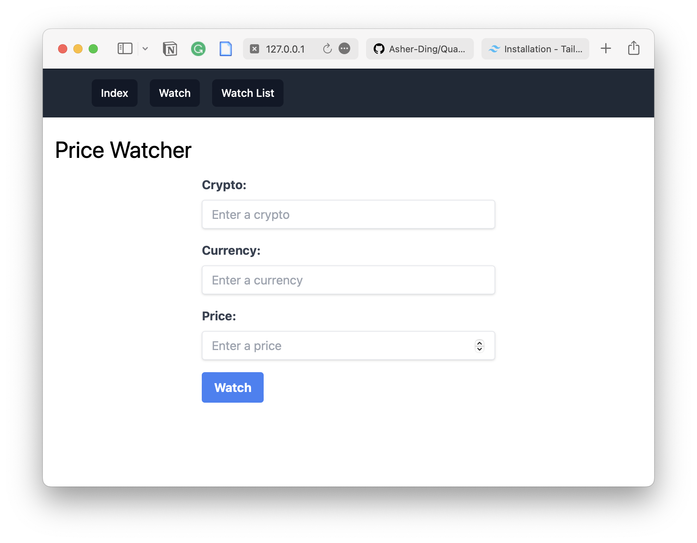

## 项目名称及概述

[查看WIKI](https://github.com/Asher-Ding/QuantitativeTrading/wiki)


**暂定项目名称：** Quantitative Trading

**概述：** Quantitative Trading 是一个面向个人的，可扩展的，易于开发和部署的量化交易程序。

**关于我：**
我是一名刚毕业于普通一本院校的大学生，目前正在自学Python和项目管理。这是我独立开发的第一个项目，旨在探索量化交易在金融市场的应用，并希望通过此项目提供一个学习和实践的平台，以帮助那些和我一样对量化交易感兴趣的新人。

作为一个对量化交易和加密市场有着浓厚兴趣的学习者，我深知量化交易在金融市场的广泛应用和其复杂性。因此，我将利用所学知识和资源，设计并开发一个基于Python的功能完备、高效稳定的量化交易程序。同时，作为一个独立项目开发的新手，我在项目的设计和开发过程中肯定会遇到各种问题，因此我会不断地积累解决经验并整理成文档以知识库的形式输出。我希望这些记录我学习和实践的过程文档可以给大家带来帮助和启发。

最后，通过该项目，我希望能够提升编程技能、丰富个人项目经验、开拓视野、结识更多志同道合的朋友，并借助不断的反馈来持续改进和创新。期待与大家共同探讨最前沿的量化交易技术和加密市场变化，共同实现梦想。

### 基础架构设计
整体采用微服务架构，后端包括策略引擎、订单管理、交易接口等不同模块，同时也有消息中间件。前端与后端采用常见的网络通信协议 RESTful API 进行交互。在后端与外围容器之间利用 Flask 和 Gunicorn 两个框架提高服务器性能。
代码存放于GitHub平台，每个模块托管于不同仓库中，便于分工协同开发和产品交付.

## 安装说明

克隆本项目

```bash
git clone --recursive https://github.com/Asher-Ding/QuantitativeTrading.git
```

```python
python setup.py install 
```

## 使用说明

## 特性&示例
实时行情推送：能够保持与交易所同步更新数据，当市场发生剧烈变化时，可以通过机器人向用户发送消息提醒
高可配置型：能够方便地修改、添加和删除策略
兼容性：支持OKX交易所

## 贡献方式

## 计划&路线图

- [ ] 需求分析和功能规划
- [ ] 设计并完成监听市场剧烈变动的功能
- [ ] 确定程序架构
- [ ] 便携基础框架
- [ ] 实现代码细节
- [ ] ...
- [ ] 优化代码组织结构，组织代码的方法是，每个子文件夹都可以为单独的Git仓库，然后通过Git Submodule指向主目录下的文件。这样设计的优点是，使每个服务可以单独开发、调试和部署，同时有助于跨团队合作管理


文档结构参考

```bash
── data
│   └── data_file
├── MANIFEST.in
├── README.rst
├── sample
│   ├── __init__.py
│   └── package_data.dat
├── setup.cfg
├── setup.py
└── tests
    ├── __init__.py
    └── test_simple.py
```

## 相关资源
[如何打包. 官方文档](https://packaging.python.org/en/latest/)

## 社区

## 版权声明

